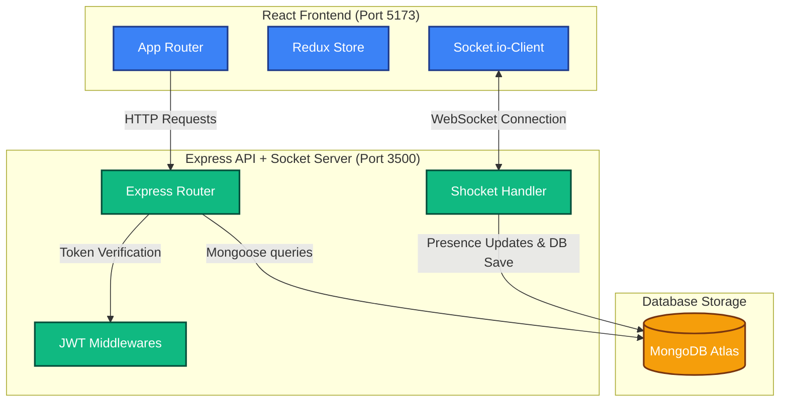
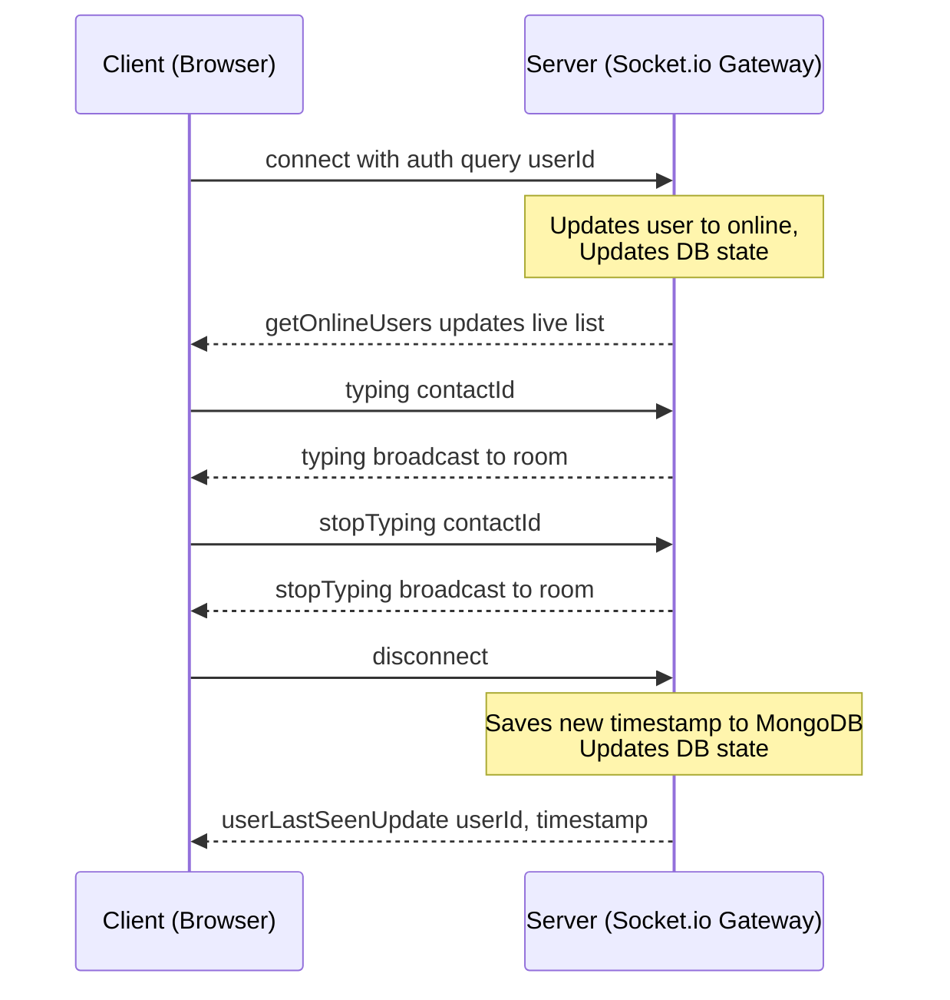

# 💬 BackChodi — Production-Grade Real-Time Chat Platform

[](https://nodejs.org/)
[](https://react.dev/)
[](https://tailwindcss.com/)
[](https://redux-toolkit.js.org/)
[](https://socket.io/)
[](https://www.mongodb.com/)
[](https://pnpm.io/)

BackChodi is a high-performance, responsive, and secure real-time messaging application built on a client-server architecture. Featuring instant message delivery, dynamic active-user presence trackers, responsive layout toggles, dark-mode capability, and database-backed persistent history, it exemplifies modern production-grade web engineering.

---

## 🏗️ Architecture Design



---

## ✨ System Features

* **⚡ Production-Grade Real-Time Operations**: Uses custom WebSockets handler (`shocket`) to achieve sub-millisecond updates for message delivery, typing indicator displays, and user status syncing.
* **🔐 Advanced Database-Backed Persistence**: Message transactions are stored durably. When a user disconnects, their exact `lastSeen` timestamp is written to the database using Mongoose and broadcasted to other clients instantly.
* **📱 Responsive Layout Switching**: Full compatibility with phone, tablet, and desktop views. Implements screen toggling on mobile devices (single column list-to-chat navigation with `ArrowLeft` back-nav) to optimize workspace widths.
* **🗃️ Persistent Chat Ranking**: Keeps track of conversation activity. Using a localized Redux store backed by `localStorage` persistence, users who have recently exchanged messages are automatically sorted to the top of the chat directory.
* **😀 Emoji Picker React Integration**: Fully customized emojis popover that sizes and flows responsively (`100% width` containers on mobile, `320px` popover on desktop) without clipping viewports.
* **🌙 Curated HSL Dark Mode**: Integrates premium, Tailwind CSS v4 class transitions to support soft, eye-strain-free dark themes (`dark:bg-[#0b141a]`).

---

## 🛠️ Full Tech-Stack breakdown

### Frontend Core (`client/package.json`)
* **React 19 & Vite 8**: Modern UI layer leveraging speedy Hot Module Replacement (HMR).
* **Redux Toolkit & React Redux**: Robust state container with automated serialization adjustments to hold the active socket channel safely.
* **Tailwind CSS v4 & @tailwindcss/vite**: Direct compilation styling framework.
* **Socket.io-Client**: Reactive WebSocket broker connecting to the server.
* **Base UI & Shadcn**: Prebuilt accessible components.
* **Zod & React Hook Form**: Type-safe frontend client validations.

### Backend Core (`server/package.json`)
* **Express 5 & Node.js**: Lightweight REST API router.
* **Socket.io**: Scalable real-time server gateway handling connection handshakes and user rooms.
* **Mongoose & MongoDB**: Object Document Mapper (ODM) structuring `User`, `Message`, and `Conversation` entities.
* **Bcryptjs & JSON Web Tokens**: High-entropy password hashing and stateless authorization via cookie channels.
* **Zod**: Declarative request payload verification middleware.

---

## 📂 System Project Layout

```text
📦 Chat App/
 ┣ 📂 client/              # React 19 Frontend
 ┃ ┣ 📂 src/
 ┃ ┃ ┣ 📂 components/      # Reusable UI primitives (buttons, inputs, sidebar wrapper)
 ┃ ┃ ┣ 📂 features/        # Redux Feature slices & thunks (auth, messages, shocket)
 ┃ ┃ ┣ 📂 hooks/           # Customized React Hooks (real-time listeners, network fetches)
 ┃ ┃ ┣ 📂 pages/           # View layouts (Home, Login, Signup)
 ┃ ┃ ┣ 📜 App.jsx          # Router configurations & main Socket lifecycle manager
 ┃ ┃ ┗ 📜 main.jsx         # App entry point
 ┃ ┗ 📜 package.json
 ┗ 📂 server/              # Node.js + Express Backend
   ┣ 📂 config/            # Env and Server Configurations
   ┣ 📂 controllers/       # API Controllers handling routing logic
   ┣ 📂 db/                # Mongoose Database Connection managers
   ┣ 📂 middlewares/       # JWT Authenticator, payload validator, and global error handlers
   ┣ 📂 models/            # Mongoose Schemas (User, Message, Conversation)
   ┣ 📂 routes/            # Express route endpoint definitions
   ┣ 📂 schemas/           # Declarative Zod payload schemas
   ┣ 📂 shocket/           # Socket.io connection handshakes and presence events
   ┗ 📜 server.js          # App initialization entry point
```

---

## 🛣️ API Endpoints Reference

| Route | Method | Access | Description |
| :--- | :--- | :--- | :--- |
| `/api/v1/user/signup` | `POST` | Public | Register a new profile |
| `/api/v1/user/login` | `POST` | Public | Secure credentials authentication (Issues HTTP-Only JWT Cookie) |
| `/api/v1/user/logout` | `POST` | Public | Clears session cookie |
| `/api/v1/user/profile` | `GET` | Private | Retrieves session profile details |
| `/api/v1/user` | `GET` | Private | Retrieves contact directory (excluding self) |
| `/api/v1/message/send/:receiverId`| `POST` | Private | Sends a text message to a user |
| `/api/v1/message/:userId` | `GET` | Private | Retrieves message logs with a specific user |

---

## 🚦 Socket.io Event Channels



| Event Name | Type | Direction | Payload | Description |
| :--- | :--- | :--- | :--- | :--- |
| `connection` | System | Client ➔ Server | `userId` (via query) | Establishes WebSocket channel, marks user online |
| `getOnlineUsers` | Custom | Server ➔ Client | `Array<string>` (userIds) | Pushes real-time list of all active connections |
| `typing` | Custom | Client ➔ Server | `receiverId` | Emits active typing state indicator |
| `stopTyping` | Custom | Client ➔ Server | `receiverId` | Clears typing indicator |
| `newMessage` | Custom | Server ➔ Client | `MessageObject` | Transmits text message instantly to receiver |
| `userLastSeenUpdate` | Custom | Server ➔ Client | `{ userId, lastSeen }` | Broadcasts exact timestamp when a user goes offline |
| `disconnect` | System | Client ➔ Server | — | Triggers MongoDB database persistence update |

---

## 🚀 Getting Started

Follow these instructions to spin up the local development servers for client and server.

### Prerequisites
* [Node.js](https://nodejs.org/) (v20 or higher recommended)
* [pnpm](https://pnpm.io/) package manager
* MongoDB instance (Local or Atlas cloud database URI)

### Local Configuration Setup

1. **Set up Backend Configurations**  
   Create a `.env` file in the `server/` directory:
   ```env
   PORT=3500
   MONGODB_URI=your_mongodb_atlas_connection_string
   JWT_SECRET=your_high_entropy_jwt_secret_key
   NODE_ENV=development
   CLIENT_URL=http://localhost:5173
   ```

2. **Set up Frontend Configurations**  
   Create a `.env` file in the `client/` directory:
   ```env
   VITE_API_BASE_URL=http://localhost:3500
   ```

### Execution Commands

Open two separate terminals:

**Terminal 1 (Backend Server)**
```bash
cd server
pnpm install
pnpm run dev
```

**Terminal 2 (Frontend Client)**
```bash
cd client
pnpm install
pnpm run dev
```

---
<div align="center">
  <i>Built with ❤️ by Prince sharam & Pair Programmers</i>
</div>
