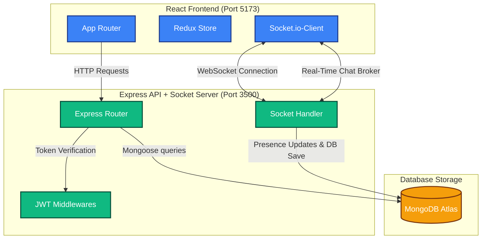
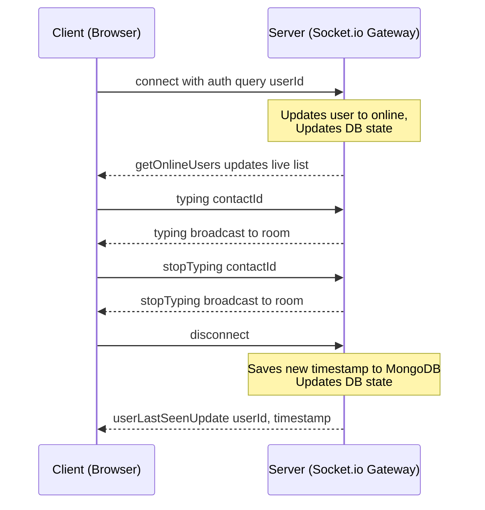

# 💬 Vaanix — Production-Grade Real-Time Social & Chat Platform

[](https://nodejs.org/)
[](https://react.dev/)
[](https://tailwindcss.com/)
[](https://redux-toolkit.js.org/)
[](https://socket.io/)
[](https://www.mongodb.com/)
[](https://pnpm.io/)

Vaanix is a high-performance, responsive, and secure real-time messaging and social feed platform built on a client-server architecture. Featuring instant message delivery, multimedia file sharing, visually adjustable cropping, interactive post feeds, active-user presence tracking, dark mode support, and persistent history, it showcases modern production-grade web engineering.

---

## 🏗️ Architecture Design



---

## ✨ System Features

* **⚡ Production-Grade Real-Time Operations**: Uses WebSockets (`socket.io`) to achieve sub-millisecond updates for message delivery, real-time typing indicators, and user status syncing.
* **📁 multimedia File Sharing in Chat**: Users can send photos, videos, PDFs, zip archives, and documents directly in chats. Integrates visual download cards and media preview bubbles.
* **✂️ Client-Side Visual Image Adjuster**: Visual cropper/panner/zoom slider built from scratch with custom HTML5 Canvas. Supports circular mask (for profile pictures) and multiple aspect ratios (1:1, 4:5, 16:9 for post media).
* **📊 Live Upload Progress Tracking**: Displays a loading indicator with real-time percentage indicators (0% to 100%) when uploading profile pictures, posts, or chat attachments.
* **📝 Social Feed & Reels**:
  * **Explore Feed**: Displays community posts with image/video rendering, caption layouts, and comments.
  * **Reels Feed**: Snap-to-scrolling vertical video player interface with double-click liking and volume controllers.
  * **Optimistic Updates**: Immediate interface feedback for liking and commenting (with automatic rollback logic in case of request failures).
* **🗃️ Persistent Chat Ranking**: Uses a localized Redux store backed by `localStorage` to automatically rank active conversations to the top of the chat list.
* **😀 Emoji Picker React Integration**: Fully customized emojis popover that sizes and flows responsively without clipping viewports.
* **🌙 Curated HSL Dark Mode**: Integrates premium, Tailwind CSS v4 class transitions to support soft, eye-strain-free dark themes.

---

## 🛠️ Full Tech-Stack Breakdown

### Frontend Core (`client/package.json`)
* **React 19 & Vite 8**: Modern UI layer leveraging speedy Hot Module Replacement (HMR).
* **Redux Toolkit & React Redux**: Global state container with automated serialization adjustments to hold the active socket channel safely.
* **Tailwind CSS v4 & @tailwindcss/vite**: Direct compilation utility-first styling.
* **Socket.io-Client**: Reactive WebSocket broker connecting to the server.
* **Base UI & Shadcn**: Prebuilt accessible components.
* **Zod & React Hook Form**: Type-safe client validation schema.

### Backend Core (`server/package.json`)
* **Express & Node.js**: Lightweight REST API router.
* **Socket.io**: Scalable real-time server gateway handling connection handshakes and user rooms.
* **Mongoose & MongoDB**: Object Document Mapper (ODM) structuring `User`, `Message`, and `Conversation` entities.
* **Cloudinary SDK**: Remote secure cloud storage for files, photos, and videos.
* **Bcryptjs & JSON Web Tokens**: High-entropy password hashing and stateless authorization via cookie channels.
* **Zod**: Declarative request payload verification middleware.

---

## 📂 System Project Layout

```text
📦 Chat App/
 ┣ 📂 client/              # React 19 Frontend
 ┃ ┣ 📂 src/
 ┃ ┃ ┣ 📂 components/      # Reusable UI primitives (ImageAdjuster, tooltip, scroll area)
 ┃ ┃ ┣ 📂 features/        # Redux Feature slices, thunks, components, and schemas (auth, posts, messages, socket)
 ┃ ┃ ┣ 📂 hooks/           # Customized React Hooks (real-time listeners, mobile detectors)
 ┃ ┃ ┣ 📂 pages/           # View layouts (Home, Feed, Reels, Profile)
 ┃ ┃ ┣ 📜 App.jsx          # Router configurations & main Socket lifecycle manager
 ┃ ┃ ┗ 📜 main.jsx         # App entry point
 ┃ ┗ 📜 package.json
 ┗ 📂 server/              # Node.js + Express Backend
   ┣ 📂 config/            # Env and Cloudinary configurations
   ┣ 📂 controllers/       # API Controllers handling routing logic
   ┣ 📂 db/                # Mongoose Database Connection managers
   ┣ 📂 middlewares/       # JWT Authenticator, payload validator, and global error handlers
   ┣ 📂 models/            # Mongoose Schemas (User, Message, Conversation, Post)
   ┣ 📂 routes/            # Express route endpoint definitions
   ┣ 📂 schemas/           # Declarative Zod payload schemas
   ┣ 📂 shocket/           # Socket.io connection handshakes and presence events
   ┗ 📜 server.js          # App initialization entry point
```

---

## 🛣️ API Endpoints Reference

### User Authentication & Management
| Route | Method | Access | Description |
| :--- | :--- | :--- | :--- |
| `/api/v1/user/signup` | `POST` | Public | Register a new profile |
| `/api/v1/user/login` | `POST` | Public | Secure credentials authentication (Issues HTTP-Only JWT Cookie) |
| `/api/v1/user/logout` | `POST` | Public | Clears session cookie |
| `/api/v1/user/profile` | `GET` | Private | Retrieves session profile details |
| `/api/v1/user/update-profile` | `PUT` | Private | Updates profile info, status bio, and profile picture URL |
| `/api/v1/user/change-password` | `POST` | Private | Updates password |
| `/api/v1/user/forgot-password` | `POST` | Public | Sends password reset email link |
| `/api/v1/user/reset-password/:token`| `POST`| Public | Completes password reset using token |
| `/api/v1/user` | `GET` | Private | Retrieves contact directory (excluding self) |

### Messages & Chats
| Route | Method | Access | Description |
| :--- | :--- | :--- | :--- |
| `/api/v1/message/send/:reciverId` | `POST` | Private | Sends a text or media message to a user |
| `/api/v1/message/:userId` | `GET` | Private | Retrieves paginated message history with a specific user |

### Social Feed & Posts
| Route | Method | Access | Description |
| :--- | :--- | :--- | :--- |
| `/api/v1/post` | `POST` | Private | Uploads a new post (image/video with caption) |
| `/api/v1/post` | `GET` | Private | Retrieves all posts sorted by date descending |
| `/api/v1/post/:postId/like` | `POST` | Private | Likes/unlikes a post |
| `/api/v1/post/:postId/comment` | `POST` | Private | Submits a text comment under a post |

---

## 🚦 Socket.io Event Channels



| Event Name | Type | Direction | Payload | Description |
| :--- | :--- | :--- | :--- | :--- |
| `connection` | System | Client ➔ Server | `userId` (via query) | Establishes WebSocket channel, marks user online |
| `getOnlineUsers` | Custom | Server ➔ Client | `Array<string>` (userIds) | Pushes real-time list of all active connections |
| `typing` | Custom | Client ➔ Server | `receiverId` | Emits active typing state indicator |
| `stopTyping` | Custom | Client ➔ Server | `receiverId` | Clears typing indicator |
| `newMessage` | Custom | Server ➔ Client | `MessageObject` | Transmits text/media message instantly to receiver |
| `messagesRead` | Custom | Server ➔ Client | `{ readerId }` | Syncs read ticks in real-time |
| `userLastSeenUpdate` | Custom | Server ➔ Client | `{ userId, lastSeen }` | Broadcasts exact timestamp when a user goes offline |
| `disconnect` | System | Client ➔ Server | — | Triggers database offline/last-seen persistence update |

---

## 🚀 Getting Started

Follow these instructions to spin up the local development servers for the client and backend API.

### Prerequisites
* [Node.js](https://nodejs.org/) (v20 or higher recommended)
* [pnpm](https://pnpm.io/) package manager
* MongoDB instance (Atlas cloud database URI or local server)
* Cloudinary Account (for image/video uploads)

### Local Configuration Setup

1. **Set up Backend Configurations**  
   Create a `.env` file in the `server/` directory:
   ```env
   PORT=3500
   MONGODB_URI=your_mongodb_atlas_connection_string
   JWT_SECRET=your_high_entropy_jwt_secret_key
   NODE_ENV=development
   CLIENT_URL=http://localhost:5173
   CLOUDINARY_CLOUD_NAME=your_cloudinary_cloud_name
   CLOUDINARY_API_KEY=your_cloudinary_api_key
   CLOUDINARY_API_SECRET=your_cloudinary_api_secret
   ```

2. **Set up Frontend Configurations**  
   Create a `.env` file in the `client/` directory:
   ```env
   VITE_API_URL=http://localhost:3500/api/v1
   ```

### Execution Commands

Open two separate terminals:

**Terminal 1 (Backend Server)**
```bash
cd server
pnpm install
pnpm run dev
```

**Terminal 2 (Frontend Client)**
```bash
cd client
pnpm install
pnpm run dev
```

---
<div align="center">
  <i>Built with ❤️ by Prince Sharma & Pair Programmers</i>
</div>
